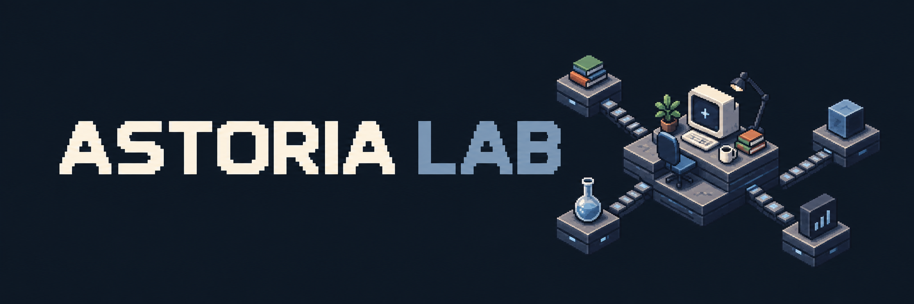

# AstoriaLab
**Adaptive Scientific Toolkit for Organized Research and Individualized Assistance.**

This is a portable personal research framework with reusable skills and workflows for AI assistants.

## About ASTORIA

ASTORIA brings together personal context, research skills, and organized workflows to help researchers work with their preferred AI tools.

The framework supplies instructions and structure. Your chosen AI assistant provides the capabilities to use them, while you remain responsible for scientific judgment and decisions.

## Architecture Detail

| Component | Purpose |
|---|---|
| **Personal context** | Describes your preferences, goals, and working environment. |
| **Companions** | The main skills you interact with for broader guidance and ongoing work. |
| **Routers** | Help companions identify the appropriate specialized skills for a task. |
| **Specialized skills** | Provide focused instructions for particular research methods, tools, or activities. |
| **Writing profiles** | Guide expression and style during applicable writing tasks. |

## Research and Learning Workflows

Areas include:

- Literature discovery, reading, and synthesis.
- Research questions, critique, and study design.
- Analysis methods and scientific tools.
- Scientific writing and revision.
- Study and academic development.
- Project context, planning, and progress capture.

## Getting Started

### Requirements

### Setup

#### Personalization

#### Your First Workflow

## Folder Structure

## Examples

